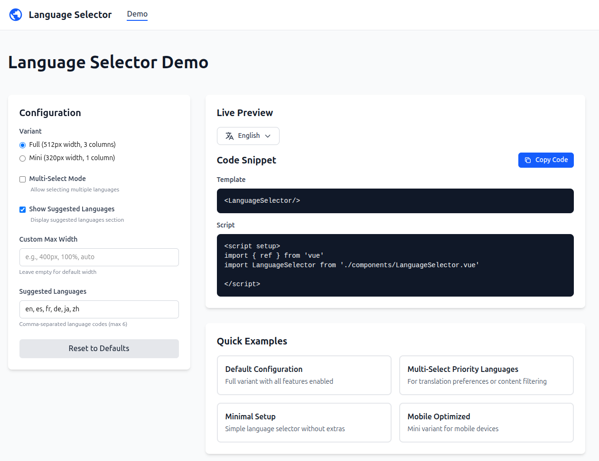
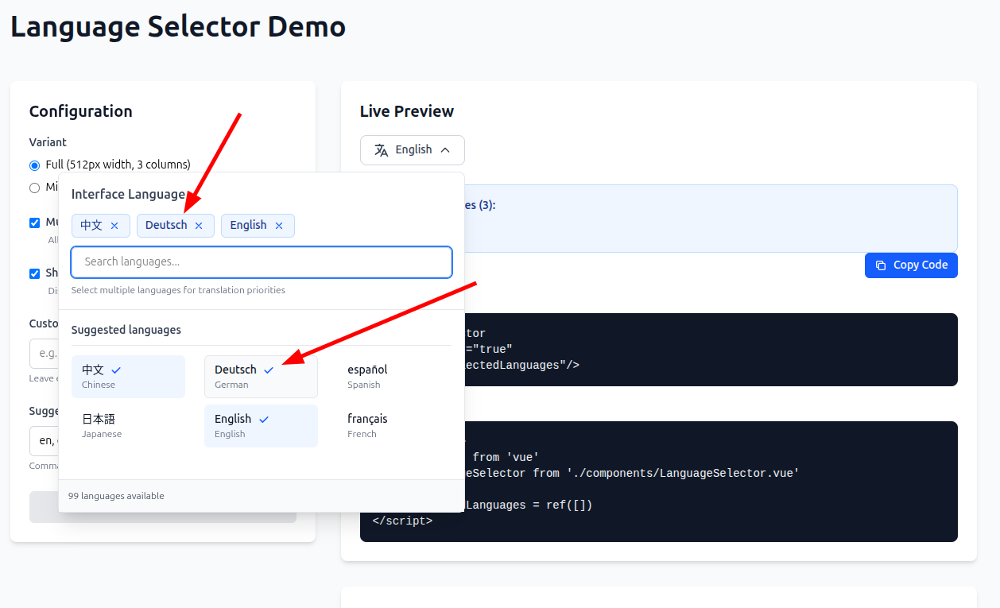
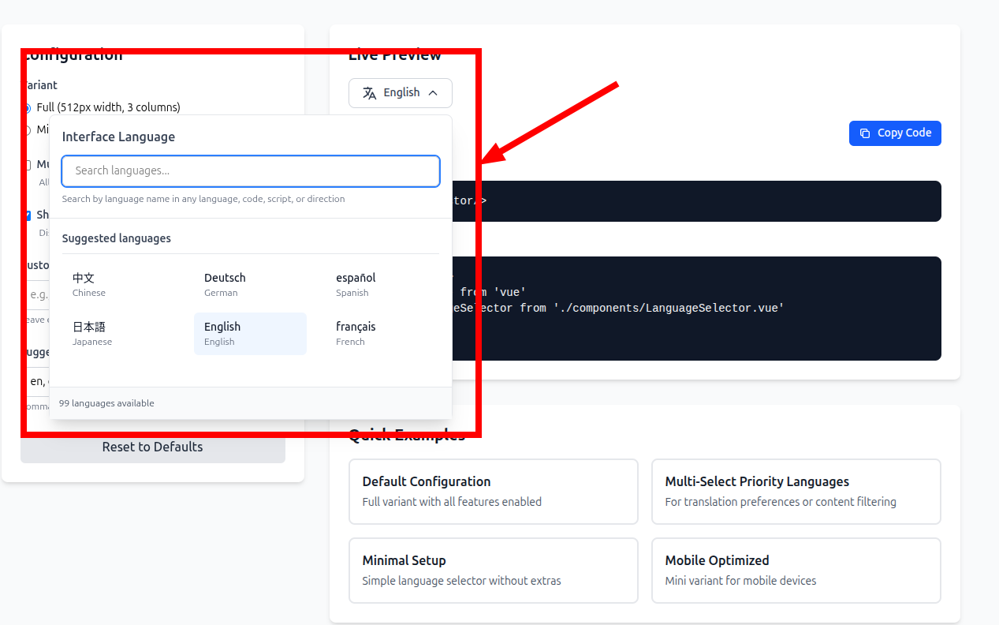
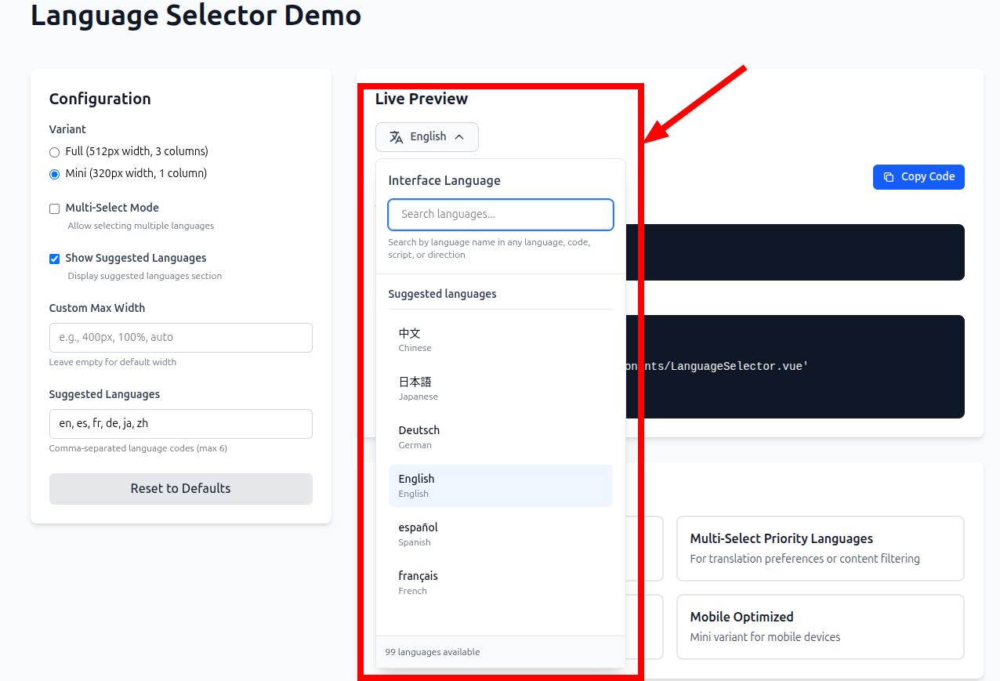

# Universal Language Selector (ULS) - Vue 3 Implementation


A modern, feature-rich language selector component for Vue 3 applications, inspired by Wikipedia's Universal Language Selector.

## Quick Start

```bash
npm install
npm run dev
```

Visit **http://localhost:5173** to see the application.

## Demo Page

Visit **http://localhost:5173/** to access the interactive demo page where you can:

- Explore all language selector variations
- Configure settings in real-time
- Copy ready-to-use code snippets
- Test multi-select mode
- Try different layouts and widths

## Features

- 🔍 **Smart Search** - Autocomplete, prefix matching, and Wikipedia API integration
- 🌐 **Script Family Sorting** - Languages organized by script (Arabic, Cyrillic, Latin, etc.)
- ✅ **Multi-Select Mode** - Select multiple languages with visual chips
- 📱 **Responsive Design** - Full and mini variants for all screen sizes
- 🔄 **RTL Support** - Proper text direction for right-to-left languages
- ♿ **Accessible** - ARIA labels, keyboard navigation, screen reader friendly
- 🎨 **Customizable** - Configurable width, suggested languages, and more

## Usage

### Basic Usage

```vue
<template>
  <LanguageSelector />
</template>

<script setup>
import LanguageSelector from './components/LanguageSelector.vue'
</script>
```

### Multi-Select Mode



```vue
<template>
  <LanguageSelector 
    :multiSelect="true" 
    v-model="selectedLanguages"
  />
</template>

<script setup>
import { ref } from 'vue'
import LanguageSelector from './components/LanguageSelector.vue'

const selectedLanguages = ref(['en', 'es', 'fr'])
</script>
```

### Custom Configuration

```vue
<template>
  <LanguageSelector 
    variant="mini"
    :showSuggested="true"
    :suggestedLanguages="['en', 'de', 'fr']"
    maxWidth="400px"
  />
</template>
```

## Documentation

- [Demo Page Guide](./DEMO_PAGE_GUIDE.md) - Interactive demo documentation
- [Multi-Select Feature](./MULTI_SELECT_FEATURE.md) - Multi-select mode guide
- [API Search Implementation](./API_SEARCH_IMPLEMENTATION.md) - Wikipedia API integration
- [Language Selector Variants](./LANGUAGE_SELECTOR_VARIANTS.md) - All available variants

## Props

| Prop | Type | Default | Description |
|------|------|---------|-------------|
| `variant` | String | `'full'` | Selector variant: 'full' or 'mini' |
| `multiSelect` | Boolean | `false` | Enable multi-select mode |
| `showSuggested` | Boolean | `true` | Show suggested languages section |
| `maxWidth` | String | `null` | Custom max-width override |
| `suggestedLanguages` | Array | `['en', 'es', ...]` | Up to 6 suggested language codes |
| `modelValue` | Array | `[]` | Selected languages (multi-select mode) |

## Variants

### Full Variant (Default)



- Width: 512px
- Layout: 3 columns, 5 items per column
- Features: All enabled
- Best for: Desktop navigation bars, settings pages

### Mini Variant



- Width: 320px
- Layout: Single column list
- Features: Compact, mobile-friendly
- Best for: Mobile devices, sidebars, tight spaces

## Technology Stack

- **Vue 3** - Composition API with `<script setup>`
- **Vite** - Next generation frontend tooling
- **Tailwind CSS** - Utility-first CSS framework
- **@wikimedia/language-data** - Language metadata and utilities
- **Vue Router** - Official Vue.js router

## 📂 Project Structure

```
src/
├── components/
│   ├── LanguageSelector.vue    # Main component
│   ├── Navbar.vue              # Navigation bar
├── composables/
│   ├── useLanguage.js          # Language state management
│   └── useArticleLanguage.js
├── views/

│   └── Demo.vue                # Interactive demo
└── router/
    └── index.js                # Route configuration
```

## Supported Languages

The selector supports 95+ languages including:

- European languages (English, Spanish, French, German, etc.)
- Asian languages (Chinese, Japanese, Korean, Arabic, etc.)
- African languages (Swahili, Hausa, Yoruba, etc.)
- And many more!

## Development

```bash
# Install dependencies
npm install

# Start dev server
npm run dev

# Build for production
npm run build

# Preview production build
npm run preview
```

## License

This project is open source and available under the [MIT License](LICENSE).

MIT License - Free to use, modify, and distribute for personal and commercial purposes.

This is a demonstration/educational implementation inspired by Wikipedia's Universal Language Selector.

## Contributing

Contributions, issues, and feature requests are welcome.

## Acknowledgments

- Inspired by [Wikimedia's Universal Language Selector](https://www.mediawiki.org/wiki/Universal_Language_Selector)
- Built with [Vue 3](https://vuejs.org/) and [Vite](https://vitejs.dev/)
- Uses [@wikimedia/language-data](https://github.com/wikimedia/language-data)
